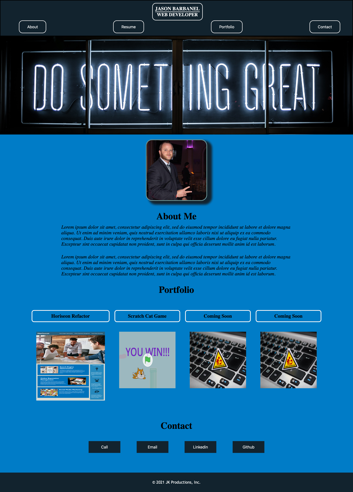

# PWProfesssionalPortfolio

1. [ Description. ](#desc)
2. [ Web Address. ](#web-address)
3. [ Usage tips. ](#usage)
4. [ Contributions. ](#contributions)

## 1. Description

### This is Jason Barbanel's Professional portfolio.

Desktop screen:

Smaller devices screen example:

## 2. How to Get There

### Click link to open in your browser.

[github pages site] https://jbarbss.github.io/JB-Personal-Portfolio/

[github repository site] https://github.com/Jbarbss/JB-Personal-Portfolio

## 3. Usage Tips

### Use the controls in the top right to visit the different sections of the web page.

Desktop screen:

Smaller devices screen example:

### View the rest of my page by scrolling up or down.

Desktop screen:

Smaller devices screen example:

## 4. Contributions
Thank you to the following for their suggestions and insights.

Ben durham

Steve Marsh

Patrick Walker

Gabe Thomas

Takuya Matsumoto
