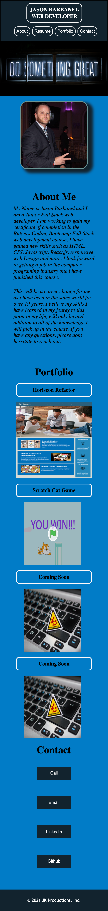

# PWProfesssionalPortfolio

1. [ Description. ](#desc)
2. [ Web Address. ](#web-address)
3. [ Contributions. ](#contributions)

## 1. Description

This personal protfolio will be able to show off my work and progress throughout my course.
The html and css pages follow best practices for file structure and nameing conventions as well ad indentations and comments.
I have included my full name, a recent photo and links to sections in my page.
If you click on the links, the page wil scroll to that section.
In the protfolio section, I have added 2 projects i have worked on so far, with the first application image larger than the other. If you click on the application, it will open in a new tab.
I have also added media queries with a responsive layout for 992px, 768px, 600px, and 400px, (please see bottom or CSS for refrence, starting on line 329)
My protfolio will deploy live with no errors and all files can be seen in my Github Repository.

Desktop screen:

Smaller devices screen example:

## 2. How to Get There

### Click link to open in your browser.

[github pages site] https://jbarbss.github.io/JB-Personal-Portfolio/

[github repository site] https://github.com/Jbarbss/JB-Personal-Portfolio

## 3. Contributions
Thank you to the following for their suggestions and insights.

Ben durham

Steve Marsh

Patrick Walker

Gabe Thomas

Takuya Matsumoto
